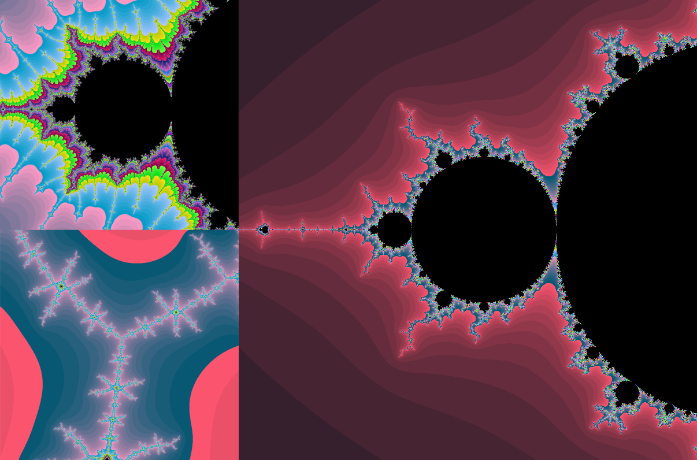

# Скриншоты


# Горячие клавишы
- **Смещение**: влево, вправо, вверх, вниз по стрелкам 
- **Масштабирование**: клавиши **+** и **-** для приближения и отдаления соответственно

# Цель работы
Изучить способы оптимизации программы на примере вычисления множества Мандельброта

# Материалы и методы
Для получения базового представления о векторизации вычислений с использованием **SIMD** команды (Single Instruction Multiple Data) я выбрал задачу построения множества Мандельброта. Вся работа проводилась на компьютере с процессором, поддерживающим набор инструкций **AVX512**

Оптимизация заключается в том, чтобы рассчитывать сразу несколько пикселей за раз. Расчёт цвета пикселя картинки производится на основании номера вылета. 
Основные формулы:
1. $r = \sqrt{x_1^2 + y_1^2}$
2. $x_1 = x_1^2 - y_1^2 + x_0$
3. $y_1 = 2 x_1 y_1 + y_0$

Как только $r$ выходит за заданный константный наибольший радиус, то расчёт точки прекращается, для неё записывается номер. По номеру уже можно по любой доступной формуле рассчитывать цвет пикселя. В моём варианте цвет пикселя рассчитывает просто линейной функцией

__________________________________________

Одна из проблем векторизации - векторизация условных ветвлений. Чтобы можно было делать особую обработку случаев для конкретных элементов массива обрабатываемых данных, используются масочные регистры и масочные команды, которые позволяют выбрать, какие из ячеек надо обрабатывать, а какие надо оставить нетронутыми.

__________________________________________

Чтобы сравнить ускорение программы, я оцениваю количество кадров в секунду. Так как расчёт пикселя может занимать время меньшее по сравнению с выводом картинки на экран, то есть части, включающей перевод номера вылета в цвет и перерисовку картинки на экране, поэтому я искусственно увеличиваю вес вычислений, проводя их фиксированное количество раз при каждой итерации цикла жизни программы. В моём случае я рассчитываю по 100 раз.
Так мы можем пренебречь расходом времени на лишние этапы программы, которые мне не важны в работе и не соответствуют её цели и use-case

# Ход работы
1. Написал *наивную реализацю*
2. Изменил код, разбив в наивной реализации вычисление на блоки, получил *блочную наивную версию*
3. Добавил в *блочную наивную версию* разбиение вычислений на функции
4. Преобразовал *блочную наивную версию* с использованием **AVX512** в *оптимизированную*
5. Измерил производительность *оптимизировнной* и *наивной* версии с учётом и без оптимизации компилятора
6. Воспользовался инструментом godbolt.org и рассмотрел ассемблерные инструкции, которые получаются на выходе компилятора
7. Сравнил набор команд, используемый комплиятором в *наивной* и *оптимизировнной* версиях
8. Сравнил оптимизацию интринсиков, используемых в *оптимизированной* версии
9. Сделал вывод

# Сравнение работы компилятора
## Сравнение *наивной* и *оптимизированной* версии
Приведу сравнение на фрагментe кода для расчёта номера вылета пикселя

```
    float x1_sqr   =          x1 * x1;
    float y1_sqr   =          y1 * y1;

    float dist_sqr = x1_sqr + y1 * y1;

    float dbl_x1y1 =      2 * x1 * y1;

    x1 = x1_sqr - y1_sqr + x0;
    y1 = dbl_x1y1        + y0;
```

### Наивная версия с `-O2`:
```
    movaps  xmm2, xmm0
    movaps  xmm3, xmm1
    mulss   xmm2, xmm0
    addss   xmm0, xmm0
    mulss   xmm3, xmm1
    mulss   xmm1, xmm0
    movaps  xmm4, xmm2
    subss   xmm2, xmm3
    addss   xmm4, xmm3
    addss   xmm1, xmm6
    movaps  xmm0, xmm2
    addss   xmm0, xmm5
```

Компилятор не в силах понять смысл кода и начать обрабатывать сразу несколько пикселей за раз, как это делаем мы. Видно, что компилятор использует **XMM** регистры для расчётов с плавающей точкой, но этого недостаточно, чтобы ускорить производительность максимально, потому что делает он это лишь для одного пикселя

### Оптимизировнная версия с `-O2`:
```
    vmulps          zmm3, zmm0, zmm0
    vmovaps         zmm2, zmm1
    vmulps          zmm0, zmm1, zmm0
    vfmadd132ps     zmm2, zmm3, zmm1
    vfmsub132ps     zmm1, zmm3, zmm1
    vaddps          zmm0, zmm0, zmm0
    vaddps          zmm0, zmm0, zmm6
    vcmpps          k0,   zmm2, zmm7, 1
    vaddps          zmm1, zmm1, zmm5
    vpmovm2d        zmm2, k0
    vpaddd          zmm2, zmm2, zmm4
    vmovdqa64       zmm4, zmm2
```

По коду видно, что компилятор во всю использует **ZMM** регистры и сразу обрабатывает почти тем же количеством команд сразу 16 пикселей

__________________________________________

## Сравнение уровней оптимизации интринсиков

Также компилятор имеет возможность оптимизировать интринсики. Чтобы показать различие в количестве используемых AVX команд, привожу [ссылку на godbolt](https://godbolt.org/z/bo83e879x) для сравнения оптимизацию кода с интринсиками. Слева приведён код на Си, справа приведено два блока соответственно сверху вниз с оптимизацией `-O2` и с `-O0`, то есть совсем без оптимизации. Внаглую можно оценить количество строк ассемблерных команд без оптимизации в 72 строки и с оптимизацией интринсиков примерно в 14. Невооруженным взглядом видно, что компилятор смог преобразовать лишние расчёты и уменьшил размер кода примерно в 5 раз

# Результаты замеров
Замеры производились при заряженном ноутбуке и работе от сети

| FPS              | `-O0` | `-O2` |
|------------------|-------|-------|
| Оптимизированная | 15.42 | 64.14 |
| Наивная          | 2.84  | 5.19  |

# Вывод
1. Компилятор не умеет понимать работу программы и оптимизировать расчёт сразу для большого массива данных
2. Используя **SIMD** команды я добился ускорения программы примерно в 12 раз
3. Компилятор имеет возможность оптимизировать интринсики, в отличие от обычных ассемблерных вставок

